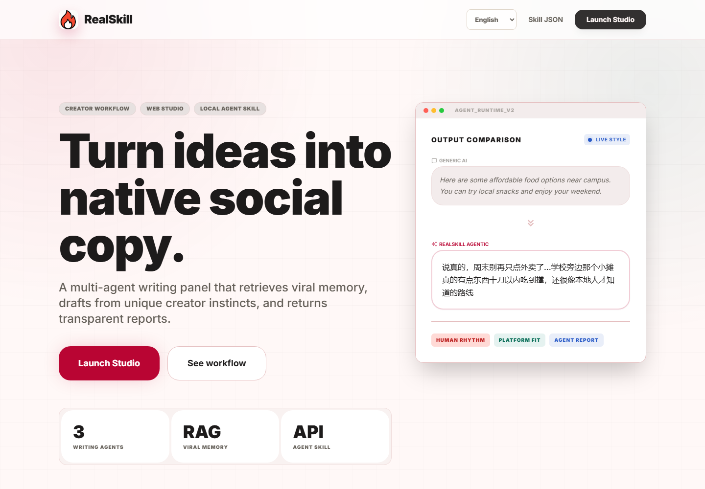
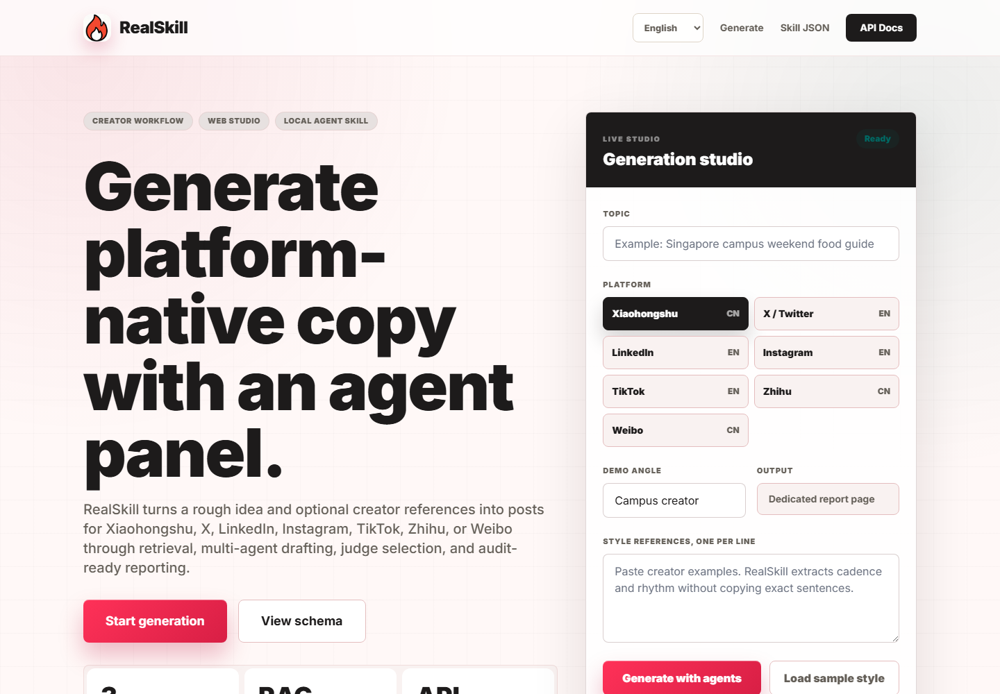
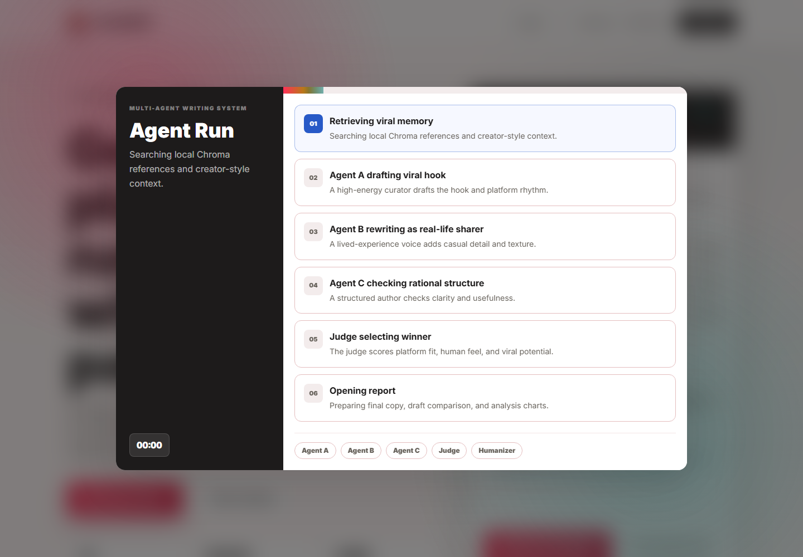
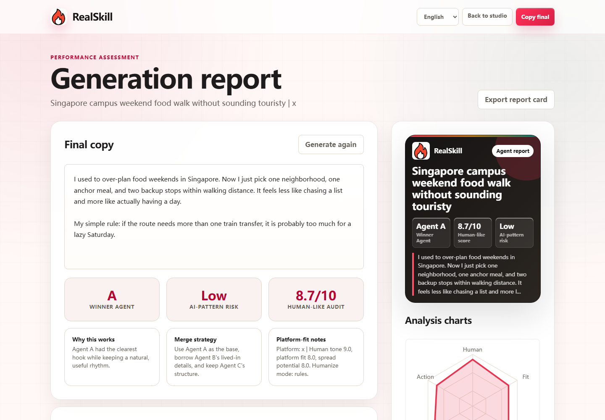
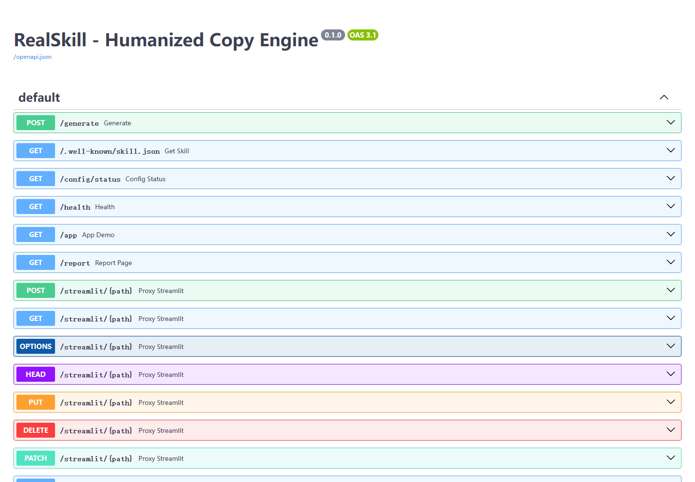

# RealSkill

RealSkill is a web studio and local agent skill that turns a rough topic into platform-native social copy through trend retrieval, multi-agent drafting, judge selection, and report-style analysis.

## Live Demo

- Live demo: https://realskill.asia/
- Web studio: https://realskill.asia/app
- API docs: https://realskill.asia/docs
- Skill discovery: https://realskill.asia/.well-known/skill.json

## 3-Step Demo Flow

1. Open the web studio and enter a topic, target platform, and optional style references.
2. Watch the Agent Run panel move through retrieval, three writing agents, judge selection, and final humanization.
3. Review the generated report with final copy, winner agent, AI-pattern risk, human-like score, comparison notes, charts, and all agent drafts.

## Screenshots











## Core Features

- Platform-native generation for Xiaohongshu, X/Twitter, LinkedIn, Instagram, TikTok, Zhihu, and Weibo.
- Domestic platforms default toward Chinese output; global platforms default toward conversational English output.
- Optional creator-style references for cadence and rhythm guidance.
- Trend retrieval and local memory through Chroma.
- Three writing agents with distinct roles:
  - Agent A: viral hook and platform rhythm.
  - Agent B: real-life sharer voice.
  - Agent C: rational structure and user value.
- Judge selection with platform fit, human tone, spread potential, clarity, originality, and actionability signals.
- Human-like audit with AI-pattern risk labeling.
- Dedicated report page with final copy, agent drafts, comparison, share card, and analysis charts.
- Web UI plus callable FastAPI endpoint and local agent skill package.

## Why RealSkill Is Different

RealSkill is not a single-prompt AI writer. It is a structured content generation workflow built around platform context, multiple agent strategies, judge selection, and explainable reports.

- It starts from platform-aware context instead of asking one generic model to write everything.
- It generates multiple drafts from distinct agent roles: viral rhythm, lived-in creator voice, and rational structure.
- It uses a judge layer to compare drafts and explain why one strategy works better.
- It cleans the final copy so users do not accidentally publish Markdown-like AI artifacts.
- It produces a report with final copy, draft comparison, audit signals, and platform-fit notes.
- It works as both a web studio and a callable local agent skill.

The goal is to help users move from one-off prompting to a repeatable content production system.

## Technical Architecture

```text
User topic + platform + optional style references
        |
        v
FastAPI server (main.py)
        |
        v
Trend retrieval + local Chroma memory
        |
        v
Agent A / Agent B / Agent C drafting
        |
        v
Judge scoring and winner selection
        |
        v
Humanization + publish cleanup
        |
        v
Web report + API response + local skill output
```

Key files:

```text
main.py                  FastAPI server, web routes, API endpoints
frontend/landing.html    Product entry page
frontend/index.html      Generation studio
frontend/report.html     Report view
core/generator.py        Retrieval and multi-agent generation orchestration
core/judge.py            Scoring, selection, and audit helpers
core/humanize.py         Humanization pass
core/publish_cleaner.py  Removes Markdown-like publishing artifacts
core/social_trends.py    Platform trend context helpers
agents/prompts.py        Agent role prompts
skill_manifest.py        Skill discovery schema
build_skill_zip.py       Local agent skill package builder
```

## Agent Skill Usage

RealSkill can be packaged as a local agent skill:

```bash
python build_skill_zip.py
```

This creates `RealSkill_agent.zip`, which contains the skill entrypoint, manifest, requirements, and generation modules.

After extracting the package into an agent skills folder, install dependencies:

```bash
pip install -r requirements_skill.txt
playwright install chromium
```

Example local call:

```python
from skill_entry import generate

result = generate({
    "topic": "Singapore campus weekend food walk",
    "platform": "x",
    "style_refs": [
        "Make it sound like a real student sharing a route they actually tried."
    ]
})

print(result["result"])
```

Agents can also discover the HTTP skill schema through:

```text
GET /.well-known/skill.json
```

## Local Running

Create and activate a virtual environment:

```bash
python -m venv venv
venv\Scripts\activate
```

On macOS/Linux:

```bash
source venv/bin/activate
```

Install dependencies:

```bash
pip install -r requirements.txt
playwright install chromium
```

Create the environment file:

```bash
copy .env.example .env
```

Build or refresh local memory:

```bash
python build_index.py
```

Start the server:

```bash
uvicorn main:app --host 0.0.0.0 --port 8000
```

Open locally:

```text
http://localhost:8000
http://localhost:8000/app
http://localhost:8000/report
http://localhost:8000/docs
```

The older Streamlit interface is still available as an optional fallback:

```bash
streamlit run app.py
```

Then visit:

```text
http://localhost:8000/streamlit
```

## Environment Variables

Copy `.env.example` to `.env` and set:

```text
OPENAI_API_KEY=your-model-key
OPENAI_BASE_URL=https://api.deepseek.com/v1
CHROMA_PATH=./chroma_db
FINAL_LLM_HUMANIZE=false
```

Notes:

- `OPENAI_API_KEY` is required for real generation.
- `OPENAI_BASE_URL` can point to any OpenAI-compatible model provider.
- `CHROMA_PATH` controls where local retrieval memory is stored.
- `FINAL_LLM_HUMANIZE=false` keeps the final cleanup path faster and more predictable.

## API Example

```bash
curl -X POST http://localhost:8000/generate ^
  -H "Content-Type: application/json" ^
  -d "{\"topic\":\"Singapore campus weekend food walk\",\"platform\":\"x\",\"style_refs\":[\"Make it practical, casual, and easy to save.\"]}"
```

Response fields include:

- `result`: final selected and cleaned copy.
- `winner_agent`: selected agent key.
- `all_variants`: drafts from Agent A, B, and C.
- `scores`: judge scoring payload.
- `ai_detection_risk`: heuristic AI-pattern risk label.
- `ai_score`: human-like audit score.
- `judge_reason`: explanation for the selected winner.

## Limitations and Future Roadmap

Current limitations:

- Real generation depends on model provider latency and availability.
- Trend context for some global platforms currently uses a fallback context layer when direct platform data is unavailable.
- The AI-pattern risk score is a transparent heuristic, not a guarantee against moderation or third-party AI detectors.
- The report is stored client-side after generation, so it is not yet a persistent team workspace.

Future roadmap:

- Persistent generation history and workspace-level saved reports.
- More direct trend connectors for X/Twitter, LinkedIn, Instagram, and TikTok.
- Team collaboration and shared brand/style memory.
- Exportable image cards and PDF report exports.
- Stronger analytics for platform fit, content rhythm, and audience intent.
- Optional browser extension or desktop agent workflow.

## License

MIT
